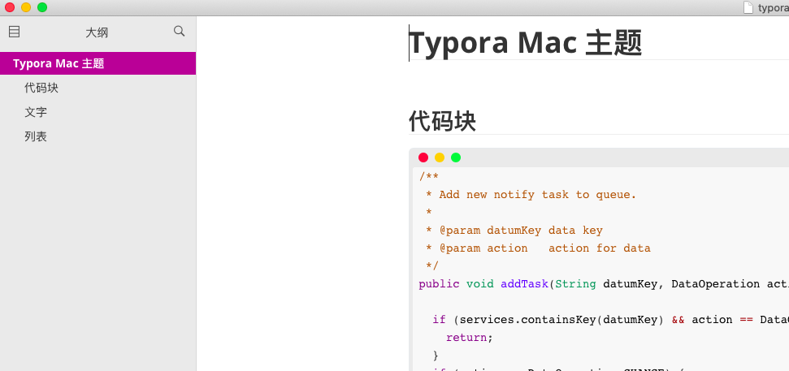
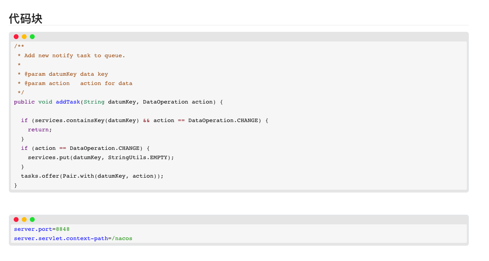

# like-mac

这是一个 **typora** 主题，根据原有github主题修改而成。主要是让typora在主题上能更好的与mac兼容。


## 使用方式

```
前往 release 中下载, 解压之后会得到 like-mac 目录和 like-mac.css 文件
将这两样移动到typora的主题目录即可
重启typora, 就可以在主题选项中选择
```


## typora效果图




## 导出效果图



