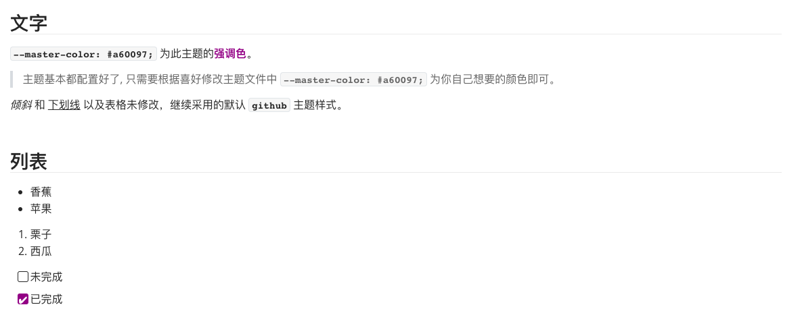

# like-mac

这是一个 **typora** 主题，根据原有github主题修改而成。主要是让typora在主题上能更好的与mac兼容。


## 使用方式

```
前往 release 中下载, 解压之后会得到 like-mac 目录和 like-mac.css 文件
将 like-mac.css 移动到typora的主题目录即可
重启typora, 就可以在主题选项中选择 Like Mac

注意: like-mac.css 中会使用到几个字体, 字体文件在typora默认的github主题目录中
```


## typora效果图


## 导出效果图


